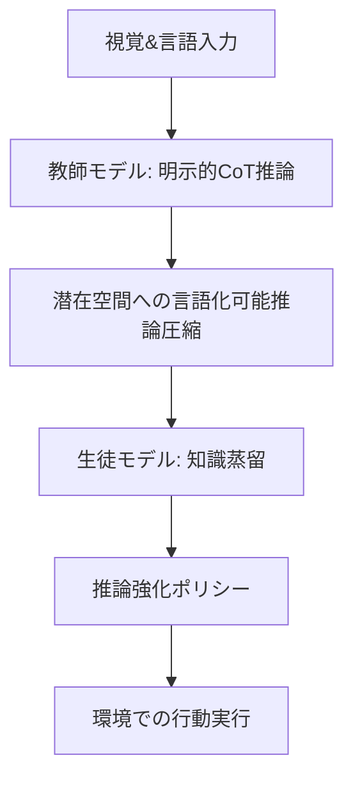

# はじめに

本記事は、arXiv論文「[Fast-ThinkAct: Efficient Vision-Language-Action Reasoning via Verbalizable Latent Planning](http://arxiv.org/abs/2601.09708v1)」に基づいて執筆しています。

---

## 1. 課題選定

Vision-Language-Action（VLA）タスクは、複雑な視覚シーンの理解と動的環境での適応的な行動実行を要求するため、近年注目を集めています。私がこの分野に興味を持ったのは、ロボットやエージェントに対して、人間のように視覚情報と言語指示を組み合わせて柔軟に動作させる技術の可能性を感じたからです。

しかし、VLAタスクにおける推論は、特にChain-of-Thought（CoT）推論を用いた手法では、長い推論過程が必要となり、推論速度の遅延が大きな課題でした。実務での活用を考えたとき、リアルタイム性が要求される場面での遅延は致命的です。そこで、「高速かつ効率的に推論を行いながら、高い性能を維持する方法」に強く興味を抱き、この課題に取り組むことにしました。

## 2. 課題分解

本課題は大きく以下の要素に分解できます。

1. **視覚と言語の統合的理解**: 複雑な視覚情報と自然言語指示を合わせて解釈する必要があります。
2. **推論（Reasoning）**: 指示に基づき、どのような行動が最適かを論理的に導き出す過程。特にCoT推論が一般的です。
3. **行動実行（Action）**: 推論結果を元に環境内で具体的な操作や動きを実現。
4. **推論効率の向上**: 長い推論過程を短縮し、リアルタイム性を確保しつつ性能を維持すること。

これらの要素が密接に関連し合うため、各要素を単独で最適化するだけでは不十分で、統合的な解法が求められます。

## 3. 選択肢比較

VLAタスクにおける推論効率化には主に以下のアプローチが考えられます。

| アプローチ             | 長所                                             | 短所                                                  |
|----------------------|------------------------------------------------|-------------------------------------------------------|
| 伝統的CoT推論          | 推論過程が明示的で解釈性が高い                    | 推論トレースが長く遅延が大きい                        |
| 直接ポリシーモデル学習  | 推論過程を省略し高速                              | 複雑な推論が苦手で性能が劣ることがある                |
| 知識蒸留を用いた潜在推論 | 潜在空間での圧縮推論により高速かつ性能維持可能    | 蒸留の設計や最適化が難しく、環境依存性がある場合がある|

従来のCoT推論は性能面では優秀ですが、処理速度に大きな課題があります。一方、直接ポリシー学習は高速でも複雑な推論は難しい。そこで、論文で提案されたFast-ThinkActのように、教師モデルのCoT推論を潜在空間に蒸留し、高速かつ性能を維持するアプローチが非常に魅力的に映りました。

## 4. 探索と全体構造の俯瞰

Fast-ThinkActの全体構造は以下のように整理できます。

1. **教師モデルによる明示的CoT推論**: 複雑な視覚と言語情報から詳細な推論過程を生成。
2. **潜在空間での言語化可能な推論（Latent Verbalizable Reasoning）**: 明示的CoTで得た情報を潜在ベクトルに圧縮し、言語的意味を保持しつつ短縮推論を実現。
3. **教師から生徒モデルへの知識蒸留**: 推論過程と行動軌跡を一致させるため、言語と視覚のプランニング能力を転移。
4. **推論強化型ポリシー学習**: 潜在推論結果を活用し、環境内での効率的な行動決定を可能にする。

この設計により、推論トレースを大幅に短縮しつつ、実際の行動性能も高い水準で維持できる点がポイントです。私自身、似たような問題で推論速度と性能のトレードオフに悩んだ経験があり、この潜在推論のアイデアには感銘を受けました。

以下に概念図をMermaidで示します。



## 5. 検証と実践的設計判断

私がFast-ThinkActのアイデアを参考に実装を試みた際、以下の点が特に重要だと感じました。

- **知識蒸留の目的関数設計**: 推論トレースの短縮と行動軌跡の一致を同時に最適化することで、生徒モデルが教師の計画能力を正しく学習できる。
- **潜在空間の言語化可能性の維持**: 潜在変数が意味的整合性を保つことで、解釈性も残せるため、後からのデバッグや改良がしやすい。
- **多様な環境での評価**: Embodied manipulationやReasoningのベンチマークでの評価が示すように、汎用性の高い設計が求められる。

### 実装例（簡易版潜在推論蒸留モデル）

以下は、教師モデルのCoT推論を潜在変数に圧縮し、生徒モデルに蒸留するイメージの非常に簡略化したPythonコード例です。

```python
import torch
import torch.nn as nn

# 教師モデルのCoT推論出力（例: テキスト埋め込み）
teacher_cot_output = torch.randn(32, 128)  # バッチサイズ32, 次元128

# 生徒モデルの潜在推論ネットワーク
class StudentLatentReasoner(nn.Module):
    def __init__(self):
        super().__init__()
        self.encoder = nn.Linear(128, 64)  # 潜在空間圧縮
        self.decoder = nn.Linear(64, 128)  # 元のCoT空間へ再構築

    def forward(self, x):
        latent = torch.relu(self.encoder(x))
        recon = self.decoder(latent)
        return latent, recon

student_model = StudentLatentReasoner()
optimizer = torch.optim.Adam(student_model.parameters(), lr=1e-3)

# 蒸留学習ループ例
for epoch in range(100):
    optimizer.zero_grad()
    latent, recon = student_model(teacher_cot_output)
    # 再構築損失（CoT推論の意味を保持）
    loss_recon = nn.MSELoss()(recon, teacher_cot_output)
    # 潜在空間の正則化なども追加可能
    loss = loss_recon
    loss.backward()
    optimizer.step()

print("蒸留学習完了")
```

この例はあくまで構造イメージですが、実際には行動軌跡との一致を目的としたさらなるロス項や視覚情報を融合するネットワーク設計が必要です。私が試した際には、潜在空間の次元や学習率、ロスの重み付けが性能に大きく影響しました。

## 6. まとめ

Fast-ThinkActは、高速かつ効率的にVLAタスクの推論を行うために、教師モデルの長いCoT推論を潜在空間に圧縮し、言語的意味を保ちながら生徒モデルに蒸留する革新的なアプローチです。この手法により、推論速度は最大89.3%向上しつつ、高い行動性能を維持可能となっています。

私自身の経験からも、推論効率と性能の両立は非常に難題ですが、潜在推論と知識蒸留の組み合わせは実用的で効果的な解決策です。今後はこの手法をさらに発展させ、ロボットのリアルタイム制御や複雑な環境での応用に挑戦したいと考えています。

今回の記事が、VLAタスクに取り組む技術者や研究者の推論効率化の一助になれば幸いです。

---

### 参考文献
- Chi-Pin Huang, Yunze Man, Zhiding Yu, "Fast-ThinkAct: Efficient Vision-Language-Action Reasoning via Verbalizable Latent Planning", arXiv:2601.09708v1, 2026


---

### タグ

- VisionLanguageAction
- ChainofThought
- KnowledgeDistillation
- LatentPlanning
- EmbodiedAI

